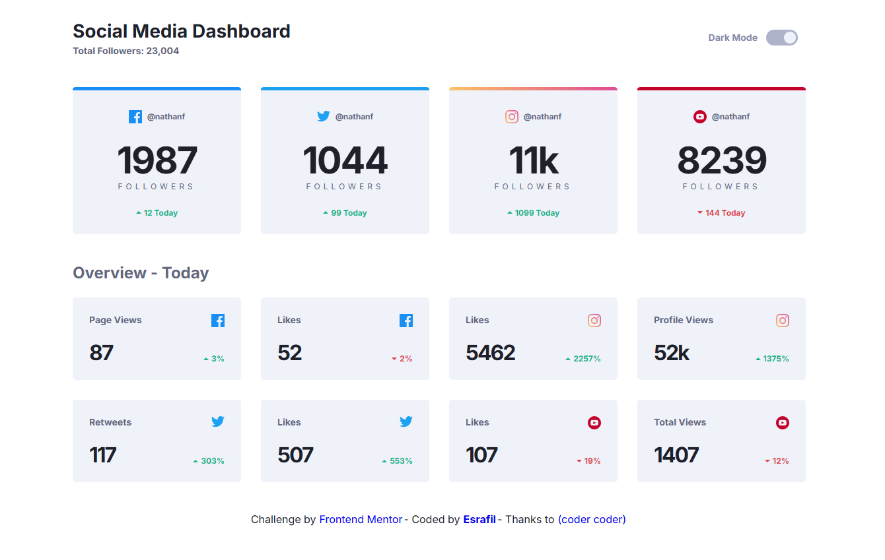
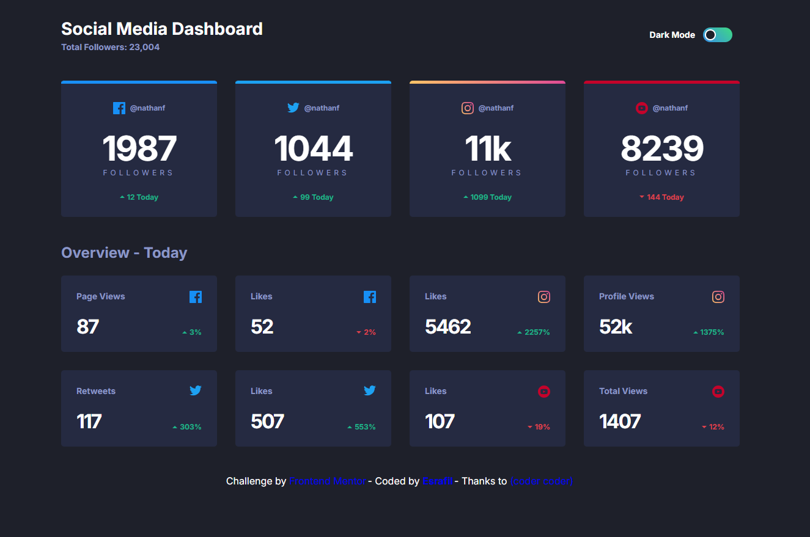

## Social Media Dashboard with Theme Switcher

This is a solution to the **Social media dashboard with theme switcher** challenge on [Frontend Mentor](https://www.frontendmentor.io/challenges/social-media-dashboard-with-theme-switcher-6oY8ozp_H).  
The challenge helped me practice building responsive layouts, managing dark/light theme toggling, and using modular front-end tools.

---

---

## 🛠️ Built With

- **HTML5** – Semantic and structured markup
- **SASS (SCSS)** – For modular and maintainable styling
- **Gulp** – To compile and automate workflow tasks
- **Vanilla JavaScript (ES6)** – For theme switching and DOM manipulation

---

## ⚙️ Features

- Dark / Light **theme switcher**
- **Responsive layout** (mobile-first approach)
- Clean, organized **SASS architecture**
- Automated build process with **Gulp**

---

## 🚀 How to Run

1. Clone this repository
2. Run `npm install` to install dependencies
3. Start the Gulp watcher with `gulp`
4. Open `index.html` in your browser
